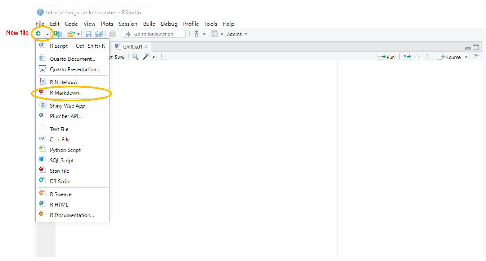
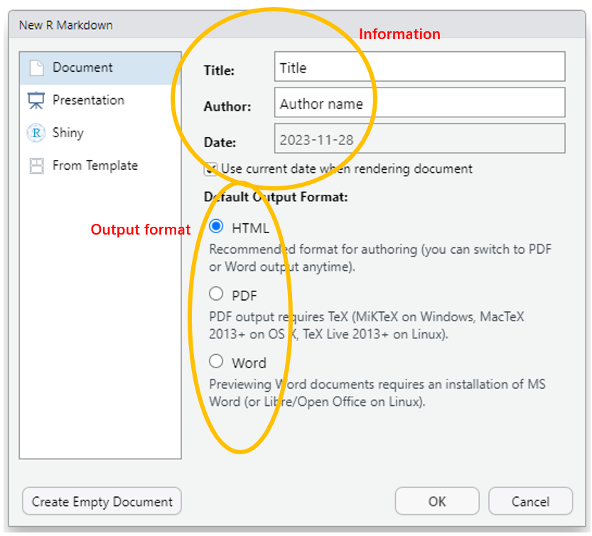
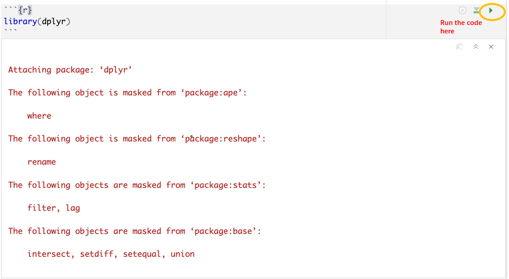
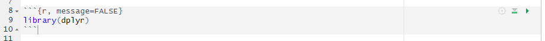
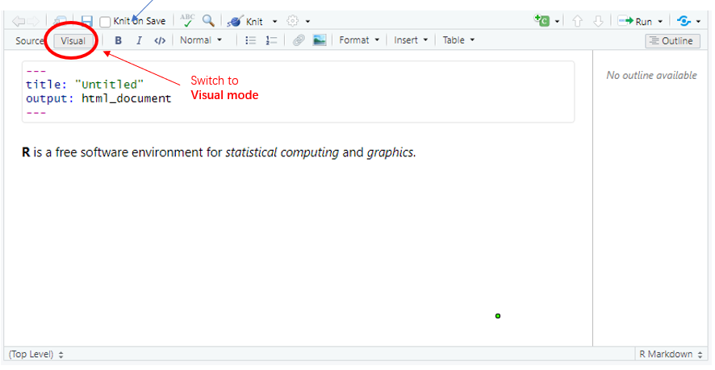
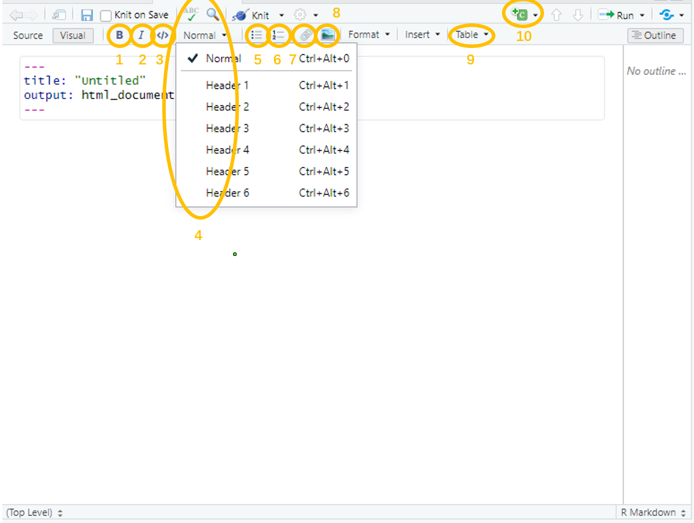

##### Tutorial developed by Langxuan Lu

------------------------------------------------------------------------

###### This work is licensed under a [MIT License](https://choosealicense.com/licenses/mit/) 

###### **You can contact Lu with any feedback or questions on [s2087922\@ed.ac.uk](mailto:s2087922@ed.ac.uk){.email}.**

------------------------------------------------------------------------

<font size="5"> Tutorial Aims: </font>

**This tutorial was inspired by the tutorial [Creating a repository with a clear structure tutorial](https://eddatascienceees.github.io/tutorial-assignment-beverlytan/) from Beverly Tan, She brought a very exciting tutorial, and she gave a little bit of introduction on R markdown, so I designed to make a further study and introduction of R markdown based on that!**\

R markdown is a reusable reporting document writing format that combines Markdown and R language. You can display various data analysis results, including code, text, and graphic analysis, in the document. When you update it, the entire analysis process will be rerun and the results will be automatically updated. Therefore, you can save a lot of time.\

R markdown provides a fast and convenient way to generate reports, academic papers, and teaching materials when using the R language for data analysis. It enables data analysts to easily showcase their work results and utilize them to improve a better analysis process, and clearer and more accurate presentation methods.\

This tutorial takes the output of HTML files from R markdown as an example to demonstrate the basic usage techniques of R markdown, including text, paragraph formatting, code blocks, charts, and more.\

------------------------------------------------------------------------

<font size="4">**Learning outcome:**</font>\

-Master the basic R markdown output format.

-Master the basic writing syntax in R markdown.

-Master adding various elements in R markdown such as links and images.

-Master the basic CSS text style.

\

<font size="4">**Tutorial Structure:**</font> 聽

------------------------------------------------------------------------

[1.Create New R markdown](#section1)\
[2.Set Output Format(s) and Options Aims](#section2)\
[3.Text Writing and Symbol](#section3)\
- Header\
- Start a New Line\
- Italics and Bold\
- Verbatim code\
- bulleted list\
- Numbered list\
- Link\
- Image\
- Table\
- Code chunk\
[4.Visual mode](#section4)\
[5.Useful syntax](#section5)\
- superscript and subscript\
- Math Equation\
- Escaped\
- Strike through\
- Underline\
- Highlight\
- Bolck quotes\
- Horizontal rule\
- Text Size\
- **css**\
- Text Colour\
- **More about CSS**\
- Paragraph Format\
- **Other useful CSS syntax**\
- Text block\
- Footnote\
- Referances\
- Create Links and ID\
[6.Advanced techniques](#section6)\
[Refrance](#section7)聽

\

<font size="5"> 1.Create New R markdown</font> <a id="section1"></a>

------------------------------------------------------------------------

> <span style="color: green;"> **Create new R markdown**</font>

Open R studio, click **"New File"** on the top left, then chose **"R Markdown..."**.\

As the picture is shown here. 

\

-   Select the output format you want to create in the pop-up window (such as HTML, PDF, or Word).
-   Enter relevant information such as the title of the document and the author's signature.
-   Save the document and start writing your R Markdown.\



\

<font size="5"> 2. Set Output Format(s) and Options</font> <a id="section2"></a>

------------------------------------------------------------------------

When we open a new markdown, we can find a string of settings at the top of it.

```         
---
title: "Untitled"
author: "Name"
output: html_document
---
```

It is a **YAML front matter**. YAML (YAML Ain't Markdown Language) front matter is used to provide metadata or settings for the Markdown document, such as a floating table of contents, multi-level title numbering, and theme style...\

YAML front matter is often used in Markdown documents, especially when using static site generators or tools like Jekyll, Hugo, or Gatsby, where this metadata helps define how the content should be processed or displayed.\

Apart from the HTML document output format I have shown, there are others, such as **pdf** or **word**.\

The details are as follows:

+----------------------------+----------------------------------------------------------------------------------------------+--------------------------------------------+
|                            | Output                                                                                       | Description                                |
+:===========================+:=============================================================================================+:===========================================+
| **Documents**              | [html_notebook](https://bookdown.org/yihui/rmarkdown/notebook.html)                          | Interactive R Notebooks                    |
+----------------------------+----------------------------------------------------------------------------------------------+--------------------------------------------+
|                            | [pdf_document](https://bookdown.org/yihui/rmarkdown/pdf-document.html)                       | PDF document (via LaTeX template)          |
+----------------------------+----------------------------------------------------------------------------------------------+--------------------------------------------+
|                            | [word_document](https://bookdown.org/yihui/rmarkdown/word-document.html)                     | Microsoft Word document (docx)             |
+----------------------------+----------------------------------------------------------------------------------------------+--------------------------------------------+
|                            | [odt_document](https://bookdown.org/yihui/rmarkdown/opendocument-text-document.html)         | OpenDocument Text document                 |
+----------------------------+----------------------------------------------------------------------------------------------+--------------------------------------------+
|                            | [rtf_document](https://bookdown.org/yihui/rmarkdown/rich-text-format-document.html)          | Rich Text Format document                  |
+----------------------------+----------------------------------------------------------------------------------------------+--------------------------------------------+
|                            | [md_document](https://bookdown.org/yihui/rmarkdown/markdown-document.html)                   | Markdown document (various flavors)        |
+----------------------------+----------------------------------------------------------------------------------------------+--------------------------------------------+
| **Presentations (slides)** | [powerpoint_presentation](https://bookdown.org/yihui/rmarkdown/powerpoint-presentation.html) | PowerPoint presentation                    |
+----------------------------+----------------------------------------------------------------------------------------------+--------------------------------------------+
|                            | [ioslides_presentation](https://bookdown.org/yihui/rmarkdown/ioslides-presentation.html)     | HTML presentation with ioslides            |
+----------------------------+----------------------------------------------------------------------------------------------+--------------------------------------------+
|                            | [beamer_presentation](https://bookdown.org/yihui/rmarkdown/beamer-presentation.html)         | PDF presentation with LaTeX Beamer         |
+----------------------------+----------------------------------------------------------------------------------------------+--------------------------------------------+
| **More**                   | [html_vignette](https://bookdown.org/yihui/rmarkdown/r-package-vignette.html)                | R package vignette (HTML)                  |
+----------------------------+----------------------------------------------------------------------------------------------+--------------------------------------------+
|                            | [github_document](https://rmarkdown.rstudio.com/github_document_format.html)                 | GitHub Flavored Markdown document          |
+----------------------------+----------------------------------------------------------------------------------------------+--------------------------------------------+
|                            | [tufte::tufte_html](https://bookdown.org/yihui/rmarkdown/tufte-handouts.html)                | HTML handouts in the style of Edward Tufte |
+----------------------------+----------------------------------------------------------------------------------------------+--------------------------------------------+
|                            | [tufte::tufte_handout](https://bookdown.org/yihui/rmarkdown/tufte-handouts.html)             | PDF handouts in the style of Edward Tufte  |
+----------------------------+----------------------------------------------------------------------------------------------+--------------------------------------------+

\

I think the most important here is the output format of **Microsoft Word document (docx)**, **PDF document**, **Interactive R Notebooks**, and **GitHub Flavored Markdown document**.

\

Apart from the output format, there is another element option you can add to the YAML front matter:\

+----------------------------------------------------------------+----------------------------------------------------------------+---------------------------------------------------------------------------------------------+
| <font size="4"> <span style="color: lightblue;">Option </font> | <font size="4"> <span style="color: lightblue;">Default</font> | <font size="4"> <span style="color: lightblue;">Discription </font>                         |
+:===============================================================+:===============================================================+:============================================================================================+
| **subtitle**                                                   | **"text"**                                                     | Adding subtitle                                                                             |
+----------------------------------------------------------------+----------------------------------------------------------------+---------------------------------------------------------------------------------------------+
| **author_sections**                                            | **TRUE**                                                       | Show section anchors on mouse hover                                                         |
+----------------------------------------------------------------+----------------------------------------------------------------+---------------------------------------------------------------------------------------------+
| **code_download**                                              | **TRUE**                                                       | Give readers an option to download the ".Rmd" source code                                   |
+----------------------------------------------------------------+----------------------------------------------------------------+---------------------------------------------------------------------------------------------+
| **toc**                                                        | **TRUE**                                                       | Add a table of contents at the start of the document, the content will depend on the header |
+----------------------------------------------------------------+----------------------------------------------------------------+---------------------------------------------------------------------------------------------+
| **toc_depth:**                                                 | **3**                                                          | The lowest level of heading to add to the contents                                          |
+----------------------------------------------------------------+----------------------------------------------------------------+---------------------------------------------------------------------------------------------+
| **includes**                                                   | **"in_header"**                                                | File of content to place in document ("before_body", "after_body")                          |
+----------------------------------------------------------------+----------------------------------------------------------------+---------------------------------------------------------------------------------------------+

: Use `?<output format>` to see all of a format's options. e.g. `?html_document`

\

<font size="5"> 3. Text Writing and Symbol </font><a id="section3"></a>

------------------------------------------------------------------------

> <span style="color: green;"> **Header**</font>

Different header styles are shown below:

```         
# header 1
## header 2
...
###### header 6
```

**Outcome:**\

# header 1

## header 2

...\

###### header 6

\

> <span style="color: green;">**Start a New Line**</font>

-   Let's first try if we can use the **enter key** to start a new line.

```         
first line
second lind
```

**Outcome:**\
first line second line

\

-   Well, the enter key is not helping.\
    In the R markdown, to start a new line, you need to add a backslash (\\) at the end of the sentence.

```         
first line\
second lind
```

**Outcome:**\
first line\
second lind

\

-   Or, using `<br>` can also achieve the same goal.

```         
first line <br> second line
```

**Outcome:**\
first line <br> second line

\

> <span style="color: green;">*Italics* and **Bold**</font>

The syntax to make the text italics or bold fonts is to add one or two asterisks (\*) before and after the character.

```         
*text* or 
**text** or 
***text*** or

OR

_text_ 
__text__
___text___
```

**Outcome:**\
*text* (Italics)\

**text** (Bold)\

***text*** (Italics and bold)

\

> <span style="color: green;">**Verbatim code**</font>

Add a **backtick (\`)** before and after the text will be verbatim code.

```         
`library(dplyr)`
```

**Outcome:**\
`library(dplyr)`

\

> <span style="color: green;">**Bulleted list**</font>

-   Add a **hyphen and a space(s) (- )**can generate a bullet point:

```         
- Point 1 
- Point 2
```

**Outcome:**\
- Point 1\
- Point 2

\

-   Unordered list/ lower level of bulleted list, use **TAB**:

```         
- Point 1 
  - point 1a
  - point 1b
- Point 2
  - point 2a
  - point 2b
```

**Outcome:**\

-   Point 1
    -   point 1a
    -   point 1b
-   Point 2
    -   point 2a
    -   point 2b

\

> <span style="color: green;">**Numbered list**</font>

A numbered list is the most direct one, just need to input **1., 2., 3., ...**

```         
1. One
2. Two
3. Three
```

**Outcome:**\

1.  One
2.  Two
3.  Three

\

> <span style="color: green;">**Link**</font>

-   The format of website link is input **Angle brackets/chevrons** before and after the link (**`<link>`**):\

**Website link**

```         
<https://www.r-project.org/>
```

**Outcome:**\
<https://www.r-project.org/>

\

-   A hyperlink is a website link inside a word, so it will pop out a website when you click the word. The format of the hyperlink is **`[text](link)`**:\

**Hyperlinks**

```         
[R download.](https://www.r-project.org/)
```

**Outcome:**\
[R download.](https://www.r-project.org/)

\

> <span style="color: green;">**Image**</font>

the format of putting an image/figure is similar to "Hyperlink", just need to add an **exclamation mark** (!) in front of the code and **replace the website link with the image file name on your computer**.\

<span style="color: red;"> **Note: the image file location in your computer should be under the markdown file that you are working on!** </font>

```         

```

**Outcome:**\


\

> <span style="color: green;">**Table**</font>

Making a table in source mode is quite not convenient, as you can see below, basically is "drawing" the table by using a vertical bar (\|) and hyphen (-).\
<span style="color: red;">So I suggest making the table in visual mode. </font>

```         
|     | Advantage |
|-----|-----------|
| R   | free      |
| R   | powerful  |
```

**Outcome:**\

|     | Advantage |
|-----|:---------:|
| R   |   free    |
| R   | powerful  |

\

Just like regular text, the text in a table can also be edited, such as bolding, changing colours, and setting hyperlinks.

```         

|                                     | Advantage  |
|:-----------------------------------:|:----------:|
| [**R**](https://www.r-project.org/) |   *free*   |
|                **R**                | `powerful` |
```

**Outcome:**\

|                                     | Advantage  |
|:-----------------------------------:|:----------:|
| [**R**](https://www.r-project.org/) |   *free*   |
|                **R**                | `powerful` |

\

So far, I have only told you how to create a framework for a table, but there is no content inside the table.\
If we have a large data frame, it is impossible to type in the content one by one into the table such a "stupid method".\

So we need to use **`knitr::kable`** to turn the data frame to table.\

Organize data and create a data frame锛?

```{r, message=FALSE, warning=FALSE}
library(dplyr)  
library(tidyverse)

load("data/LPI_data.Rdata")

data <- data %>%                                                          
        filter(Common.Name == "Abbott's booby")  %>%                                       
        select(id, Common.Name, X1991)
```

\

So we need to convert the data frame into a table using **`knitr::kable`**:

```{r}
knitr::kable(data)
```

\

Simultaneously, we can use 'caption' to add captions to the table and limit the decimal point to two digits with digits.

```{r}
knitr::kable(data,
             caption = "population and id of Abbott's booby in 1991",
             digits = 2)
```

\

> <span style="color: green;">**Code chunk**</font>

A code chunk is a runnable piece of R code. Re-producing the document will re-run calculations. Code chunk technology is beneficial because the risk of mismatch between the commentary in a paper and the results being discussed is reduced.\
You can easily make a code chunk by surrounding it with **```` ``` ````** before and after the code.

````         
```
library(dplyr)
read.csv(data)
lm(mass~year,data = data)
```
````

\
Of course, you can also tell R which coding language you are using, for example, R language. Adding **`{r}`** after the top **```` ``` ````**.

The code can be run by clicking the green start button on the top right corner of the R code chunk.\
the result will show below the code chunk



\

Not only R language, but also Python, Stan, and Bash\
just need to replace **`{r}`** in the code chunk into **`{python}`**, **`{stan output.var=}`**, or **`{bash}`**.\

\

But if you can see, there are some messages or warnings that might show in the outcome. what if we don't want that shown in our markdown, because that looks messy. (Please ignore the Chinese word in my result, since my computer system is in Chinese, it should be English on your own computer)\

\

We can tell the code chunk that we don't want you to show the message, by adding **`message = FALSE`** inside **{r}**.



\

Not only massage, there are other options we can add in, as you can see in the table below.

\

+----------------------------------------------------------------+---------------------------------------------------------------+-----------------------------------------------------------------------------------------------------+
| <font size="4"> <span style="color: lightblue;">Option </font> | <font size="4"><span style="color: lightblue;">Default</font> | <font size="4"><span style="color: lightblue;">Effect </font>                                       |
+:===============================================================+:==============================================================+:====================================================================================================+
| **echo**                                                       | TRUE                                                          | display code in the output document                                                                 |
+----------------------------------------------------------------+---------------------------------------------------------------+-----------------------------------------------------------------------------------------------------+
| **error**                                                      | FALSE                                                         | TRUE (display error messages in doc)                                                                |
|                                                                |                                                               |                                                                                                     |
|                                                                |                                                               | FALSE (stop render when errors occur)                                                               |
+----------------------------------------------------------------+---------------------------------------------------------------+-----------------------------------------------------------------------------------------------------+
| **include**                                                    | TRUE                                                          | include chunk in doc after running                                                                  |
+----------------------------------------------------------------+---------------------------------------------------------------+-----------------------------------------------------------------------------------------------------+
| **message**                                                    | TRUE                                                          | display code messages in the document                                                               |
+----------------------------------------------------------------+---------------------------------------------------------------+-----------------------------------------------------------------------------------------------------+
| **warning**                                                    | TRUE                                                          | display code warnings in the document                                                               |
+----------------------------------------------------------------+---------------------------------------------------------------+-----------------------------------------------------------------------------------------------------+
| **result**                                                     | "markup"                                                      | "asis" (passthrough results) "hide" (don't display results) "hold" (put all results below all code) |
+----------------------------------------------------------------+---------------------------------------------------------------+-----------------------------------------------------------------------------------------------------+

: see more options and defaults running **`str(knitr::opts_chunk$get())`**

\

<font size="5"> 4. Visual mode </font><a id="section4"></a>

------------------------------------------------------------------------

The various text editing code skills we just showed are all implemented in the **Sources mode**.\

<span style="color: red;">Sources mode is the underlying code that displays the generated content, so currently we are using coding to write text.</font>

Now, maybe we can try switching to visual mode,

<span style="color: red;">Visual mode displays the content that appears when presented or published, and without displaying code. This mode allows us to directly interact with content, and make changes in a visual way, we don't need to deal with underlying code, just feel like using a Word. document.</font>

\
To switch from source mode switch to visual mode, simply click the **"visual"** button in the upper left corner, as shown in the following figure.\


\

After switching to visual mode, we can click the icon in the top toolbar to interactively edit the text, just like Word. document!\



1.  Bold (Ctrl + B)

2.  Italic (Ctrl + I)

3.  Code (Ctrl + D)

4.  Block format, headers

5.  Bulleted list

6.  Numbered list

7.  Link (Ctrl + K)

8.  Figure/image

9.  Table

10. Code chunk

\

<span style="color: red;">Although Visual mode is very convenient and allows us to quickly create tables and inset images, it is worth noting that Visual mode does not support many useful features, including but not limited to custom text size or colour.</font>

**If we want to change the text font size or colour, we can only code in source mode. So I suggest that be proficient coding under sources mode would be better.**\

In the below, I will introduce these functions that can only be achieved using coding syntax.

\

<font size="5"> 5. Useful syntax</font><a id="section5"></a>

------------------------------------------------------------------------

> <span style="color: green;">**Superscript and Subscript**</font>

When we write **square units or volume units**, we need to use superscript, which refers to a word, letter, number, or symbol written or printed just above a word, letter, number, or symbol, usually in a smaller size. When writing mathematical formulas, superscripts and subscripts are also essential skills that must be mastered.

```         
superscript^2^

subscript~2~
```

**Outcome:**\
superscript^2^

subscript~2~

\

> <span style="color: green;">**Math Equation**</font>

As mentioned just now, when writing mathematical formulas, both superscripts and subscripts are often required. So if we want to turn regular text into a typeface for mathematical formulas, simply add **Dollar sign (\$)** before and after the text we want to turn.\

**Curly brackets/braces{ } is just the same with the Round brackets/parentheses() in math.**

```         
$y=mx+c$

$y=x^m+c$

$y=x^{mz}+c$
```

**Outcome:**\
$y=mx+c$

$y=x^m+c$

$y=x^{mz}+c$

\

R can also recognize pi($\pi$), but only when it is in the mathematical formula syntax.

```         
$\pi$
```

**Outcome:**\
$\pi$

\

Here are other useful mathematical notation

| Mathematical Notation | Code       |
|:---------------------:|------------|
|       $\alpha$        | `$\alpha$` |
|        $\beta$        | `$\beta$`  |
|       $\gamma$        | `$\gamma$` |
|       $\delta$        | `$\delta$` |
|       $x_{ij}$        | `$x_{ij}$` |

For details, please see [here](https://rpruim.github.io/s341/S19/from-class/MathinRmd.html)\

\

What if you want to make your mathematical formulas more "professional"? Just like the formulas in academic papers, which are placed in the centre and have a separate block, we can use two \$ placed before and after the formula to make an equation block.\

Let's use the great Mass-energy equivalence as an example锛?

```         
$$E=mc^2$$
```

**Outcome:**\
$$E=mc^2$$\

\

> <span style="color: green;">**Escaped**</font>

Let me ask a question, how to write *\*Italics\**?\

Because the syntax of *Italics* (\*Italics\*)and **Bold** (\*\*Bold\*\*) overlap, if you want to put an asterisk(\*) in font and after an italics text, but R doesn't know which `*` is text and which one is syntax. That's why we need **escaped syntax**\
Basically, it means that the symbol after the backslash maintains text.

```         
\!

*\*Italics\**
```

**Outcome:**\
!

*\*Italics\**

\

> <span style="color: green;">**Strikethrough**</font>

`~~Strikethrough~~`

**Outcome:**\
~~Strikethrough~~

\

> <span style="color: green;">**Underline**</font>

```         
<u>underline</u>
```

**Outcome:**\
<u>underline</u>

\

> <span style="color: green;">**Highlight**</font>

```         
<mark>highlight</mark>
```

**Outcome:**\
<mark>highlight</mark>

\

> <span style="color: green;">**Bolck quotes**</font>

A useful element that can help you separate different points, just like what I am using to separate different syntax!\
Adding **greater-than sign (\>)** in front of the text:

```         
> Point 1

> point 2

> point 3a
  point 3b
```

**Outcome:**\

> Point 1

> point 2

> point 3a\
> point 3b

\

> <span style="color: green;">**Horizontal rule**</font>

The other useful element to separate different content is adding a horizontal rule between two paragraphs or sections.\
Which can be achieved by using three or more hyphens (-).\
You just need to type in three (-), and R will automatically turn it into long-form when you save the markdown or Knit it.

<span style="color: red;"> **But remember! there should be a blank line before and after the `---`!** </font>\
When you see the `---` turn blue it means it is horizontal rule.

```         
Introduction: \
  R is a tool for processing data

---

Method: \
  Learn R from tutorials.

----

Result: \
  R have many packages and functions.

--------------

Conclusion: \
  R is Good!
```

**Outcome:**\

Introduction:\
R is a tool for processing data

------------------------------------------------------------------------

Method:\
Learn R from tutorials.

------------------------------------------------------------------------

Result:\
R has many packages and functions.

------------------------------------------------------------------------

Conclusion:\
R is Good!

\

> <span style="color: green;">**Text Size**</font>

The other most important thing is to change the text size and colour.

-   Size

```         
<font size="4"> Text: </font>

<font size="5"> Text: </font>

<font size="6"> Text: </font>
```

**Outcome:**\
<font size="4"> Text: </font>

<font size="5"> Text: </font>

<font size="6"> Text: </font>

\

Here we can see that this is a `<font>` tag, it is an HTML element, which is used for specifying the font size, colour, and face for text.\
**`<font>` This is the opening tag ,while `</font>`is the closing tag**. The text surrounded by tags will apply the input instructions\
For example, here we put the command 'size="4"' inside, and the text surrounded by the tag is of size 4. The default font size is 3.\

However, it's important to note that using the <font> tag is considered outdated and not recommended in modern HTML. Instead, **CSS (Cascading Style Sheets) is the preferred method for styling HTML elements.**\

[**CSS**]{style="color: green; font-size: 20px;"}

<span style="color: red;">This code uses the <span> element with inline CSS to set the font size to 16px. **The** <span> element is more versatile and is often used for applying styles without any specific semantic meaning.

The syntax of CSS is similar to `<font>`, However, `<font>` can only be used to change font size, but can't apply colour, while `<span>` is compatible, including but not limited to these two instructions.\

**Also, CSS do not require the ending** </span> tag , just the font tag is fine. R will automatically apply this setting to all subsequent text.

\
It is worth noting that the **unit of text in CSS is pixels(px)**, but not the 1,2,3... unit like in `<font>`.

The default text pixel for R markdown is 15px.

-   **So how do we tell R when to stop applying settings? It's very simple, just press enter to leave one blank line锛?**

```         
<span style="font-size: 16px;">Text:
text1

<span style="font-size: 20px;">Text:

text1
```

**Outcome:**\
<span style="font-size: 16px;">Text:\
text1\
(As long as there are no blank lines between, CSS settings will always be applied to subsequent text.)\

<span style="font-size: 20px;">Text:\

text1\
(Blank line will stop the CCS style)\

\

Or, you can use `</span>` to stop the CCS style, just like the ending <font> tag.

```         
<span style="font-size: 25px;">Text:</span> text 1
```

**Outcome:**\
[Text:]{style="font-size: 25px;"} text 1\

\

> <span style="color: green;">**Text Colour**

I will continue to use the CSS style below. Because it is really much more useful than `</font>`.

```         
> <span style="color: red;">**RED**

> <span style="color: blue;">**BLUE**

> <span style="color: green;">**GREEN**
```

**Outcome:**\
<span style="color: red;">**RED**

<span style="color: blue;">**BLUE**

<span style="color: green;">**GREEN**

We can see that the CCS style syntax of changing text colour is similar to changing text size, just need to change `"front-size: 10px"` to `"color: red"`.

\

-   In addition to ordinary single-tone colours such as red, green, and blue, CSS can also recognise other complex colours, such as light blue and light green, or even HTML color codes, you can check all the codes [here](https://htmlcolorcodes.com/).

```         
<span style="color: lightgreen;">**lightgreen**

<span style="color: #CD5C5C;">**IndianRed**
```

**Outcome:**\
<span style="color: lightgreen;">**lightgreen**

<span style="color: #CD5C5C;">**IndianRed**

\

-   Also, we can use **rgba(red, green, blue, alpha)** to custom colour.\
    Alpha refers to the transparency of the color(0\~1), 0 is complete transparency.

```         
<span style="color:rgba(0, 0, 0, 0.9);">  grey

<span style="color:rgba(255, 0, 0, 0.9);">  red
```

**Outcome:**\
<span style="color:rgba(0, 0, 0, 0.9);"> grey

<span style="color:rgba(255, 0, 0, 0.9);"> red\

the maximum value of each colour is 255, so **pure red is rgba(255, 0, 0, 0.9)**.\
you can try more combinations of rgba yourself!

\

> <span style="color: green;">**More about CSS**

Do we have to use `<span>` to change the CSS style? What does span mean?\

In fact, **the word "span" is just the name we gave to the style instructions, and it can be completely replaced with other words**.\

We can try replacing `span` with `apple`:

```         
<apple style="color: green;">**Other useful CSS syntax**
 
<apple style="color: green;">**Other useful CSS syntax**</apple>
```

**Outcome:**\
<apple style="color: green;">**Other useful CSS syntax**

<apple style="color: green;">**Other useful CSS syntax**</apple>\

\

-   The other syntax to add style to text is `[text]{style}`.\

```         
[Text:]{style="font-size: 20px;"}

[Text:]{style="color: green;"}

[Text:]{style="font-size: 20px; color: green;"}
```

**Outcome:**\
[Text:]{style="font-size: 20px;"} (size)

[Text:]{style="color: green;"} (colour)

[Text:]{style="font-size: 20px; color: green;"} (size and colour)

\

> <span style="color: green;">**Paragraph Format** </font>

How to adjust indentation, line spacing, etc? You can use HTML tags to format paragraphs as well:\

```         
paragraph indent:
<p style="text-indent: 2em;">text</p>

Row spacing:
<p style="line-height: 1.5;">text</p>

Distance between front and back segments:
<p style="padding-top: 10px; padding-bottom: 10px;">text</p>
```

**Outcome:**\
paragraph indent:

<p style="text-indent: 2em;">

text

</p>

Row spacing:

<p style="line-height: 1.5;">

text

</p>

Distance between front and back segments:

<p style="padding-top: 10px; padding-bottom: 10px;">

text

</p>

\

> <span style="color: green;">**Other useful CSS syntax**

I will also provide other useful CSS options here:

+------------------+----------------------------+--------------------------------------------------------------------------------------------------------------------------------------------------------------------------+
| Option           | Example                    | Description                                                                                                                                                              |
+:=================+:===========================+:=========================================================================================================================================================================+
| font family      | `"font-family: verdana;"`  | Change the font family, such as Arial...                                                                                                                                 |
+------------------+----------------------------+--------------------------------------------------------------------------------------------------------------------------------------------------------------------------+
| background color | `"background-color: red;"` | Change the background colour                                                                                                                                             |
+------------------+----------------------------+--------------------------------------------------------------------------------------------------------------------------------------------------------------------------+
| opacity          | `"opacity: 0.5;"`          | Adjusts the transparency of an element (range: 0\~1)                                                                                                                     |
+------------------+----------------------------+--------------------------------------------------------------------------------------------------------------------------------------------------------------------------+
| text align       | `text-align: center`       | The position of the text (right, center, left).                                                                                                                          |
+------------------+----------------------------+--------------------------------------------------------------------------------------------------------------------------------------------------------------------------+
| vertical align   | `vertical-align: middle`   | The position of text (top, middle, bottom)                                                                                                                               |
+------------------+----------------------------+--------------------------------------------------------------------------------------------------------------------------------------------------------------------------+
| padding          | `padding:40px 0`           | create space around an element's content inside its border. **`40px`** is the value for the top and bottom padding. **`0`** is the value for the left and right padding. |
+------------------+----------------------------+--------------------------------------------------------------------------------------------------------------------------------------------------------------------------+

\

> <span style="color: green;">**Text block**

If you want to highlight a paragraph or a sentence in your markdown, you can use a text block to make space around this paragraph and draw the reader's attention.\
Text block is similar to the **equation block (`$$a+b=c$$`)**, but only replace the equation inside with text.\

Using the CSS options we have learned above, we can create a custom "text block"\

```         
<div style="background-color:rgba(20, 100, 150, 0.0470588); text-align:center; vertical-align: middle; padding:40px 0;"> text </div>
```

**Outcome:**\

::: {style="background-color:rgba(20, 100, 150, 0.0470588); text-align:center; vertical-align: middle; padding:40px 0;"}
text
:::

\
<span style="color: red;">Here we can see that CSS can hold a lot of options, theoretically, it can make a lot of combinations.\

**So, R markdown is very powerful, there are only things that you cannot imagine, yet nothing R cannot achieve.**

\

> <span style="color: green;">**Footnote**

Footnotes are notes placed at the bottom of the page in a piece of academic writing and indicated in the text with superscript numbers (or sometimes letters or other symbols).\
It is useful when you write academic papers in R markdown.

```         
phytoremediation is an effective way to remove heavy metals from the soil.[^1]

[^1]: Phytoremediation uses plants to clean up contaminated environments.
```

**Outcome:**\

**Phytoremediation is an effective way to remove heavy metals from the soil.**[^1]

[^1]: **Phytoremediation uses plants to clean up contaminated environments.**

When you click on the footnote, it will jump to the explanation, which is automatically placed at the bottom of the markdown.聽

\

> <span style="color: green;">**Referances**

Apart from the footnote, bibliographies and citations are necessary when you writing an academic markdown.\

But it is more complex to make a reference compare to make a footnote. You need to make a **BibTeX** file. **BibTeX file commonly used for managing bibliographic references.**\

You can create this file manually using a text editor or reference management software.

**Step:**\

1.  Open a Text Editor: Open a plain text editor like Notepad (Windows), TextEdit (Mac), or any code editor of your choice.

\

2.  Then input the information of the literature you are citing in the following format.

```         
@article
{article1,
  author = {Author, A.},
  title = {Title of the Article},
  journal = {Journal Name},
  year = {2023},
  volume = {1},
  pages = {1-10},
  doi = {DOI_number}
} 
```

\

**For example, this is my main text and reference锛?**\

**Paper锛?**Phytoremediation is a green solution to the problem of heavy metal pollution.(Ali, 2013)\

**Referance锛?** *Hazrat Ali, Ezzat Khan, Muhammad Anwar Sajad (2013), "Phytoremediation of heavy metals---Concepts and applications", Chemosphere, 91(7), pp: 869-881*\
\

So, my Notepad will be锛?

```         
@article
{Ali2013,
  author = {Hazrat Ali, Ezzat Khan, Muhammad Anwar Sajad},
  title = {Phytoremediation of heavy metals鈥擟oncepts and applications,},
  journal = {Chemosphere,},
  year = {2013},
  volume = {91(7)},
  pages = {869-881},
}
```

\

3.  After finish the content of BibTeX file, [save the file with a `.bib` extension, such as **`references.bib`**.]{style="color: red;"}\
    Make sure to set the file type as "All Files" when saving to avoid adding a .txt extension.

\

4.  Then import your BibTeX file in your YAML front matter at the top of the markdown - **`references.bib`**.

```         
---
title: "Markdown "
bibliography: references.bib
link-citations: true
---
```

\

<span style="color: red;">Note that we've also specified the link-citations option, which will make your citations hyperlinks to the corresponding bibliography entries.

\

5.  Finally, we can cite references like when writing a regular paper:\

```         
Phytoremediation is a green solution to the problem of heavy metal pollution. [@Ali2013]
```

\

<span style="color: red;">Pay attention to the format: **`[@ uthor year]`**, and not space between them.

\

**Outcome:**\
**Phytoremediation is a green solution to the problem of heavy metal pollution. [@Ali2013]**

\

If we click on the citing, it will jump to the reference at the bottom of the markdown.

\

> <span style="color: green;">**Create Links and ID**

If you have seen the tutorial from coding clubs, you will find that there is always a list of learning outcomes and key take-home knowledge at the beginning of the markdown, you can directly jump to the point of interest by clicking the list, saving your the time to browse through the entire tutorial.\

This is a very useful technique, to achieve this type of link, you need to create some IDs.

```         
**Crate id**
1. New R markdown                       <a id="section1"></a>
2.Set Output Format(s) and Options Aims <a id="section2"></a>
3.Text Writing and Symbol               <a id="section3"></a>
4.Visual mode                           <a id="section4"></a>
5.Useful syntax                         <a id="section5"></a>
6.Advanced techniques                   <a id="section6"></a>
Refrance                                <a id="section7"></a>

**Crate link and give id**
[1.New R markdown]                        (#section1)
[2.Set Output Format(s) and Options Aims] (#section2)
[3.Text Writing and Symbol]               (#section3)
[4.Visual mode]                           (#section4)
[5.Useful syntax]                         (#section5)
[6.Advanced techniques]                   (#section6)
[Refrance]                                (#section7)

The spaces are just for good looking! No space between [] and () when in code锛?
```

**Outcome:**\

**I set these IDs in the corresponding place in this tutorial!**\

[1.New R markdown](#section1)\
[2.Set Output Format(s) and Options Aims](#section2)\
[3.Text Writing and Symbol](#section3)\
[4.Visual mode](#section4)\
[5.Useful syntax](#section5)\
[6.Advanced techniques](#section6)\
[Refrance](#section7)\

\

**you can see the syntax of putting a link and ID is the same as creating website link(`[R download.](https://www.r-project.org/)`).**

But it has an extra **Number sign (\#)** in front of the link, I think this is to make it easier for us to distinguish between hyperlinks and ID links.

\

<font size="5"> 6. Advanced techniques</font><a id="section6"></a>

------------------------------------------------------------------------

As I mentioned earlier, R markdown is a very powerful tool. In addition to HTML webpages like Markdown, it can also be used to create [**Notebooks**](https://rmarkdown.rstudio.com/lesson-10.html), [**Slide Presentations**](https://rmarkdown.rstudio.com/lesson-11.html), [**Dashboards**](https://rmarkdown.rstudio.com/lesson-12.html), [**real Websites**](https://rmarkdown.rstudio.com/lesson-13.html), [**and Interactive Documents**](https://rmarkdown.rstudio.com/lesson-14.html).\

However, this is not included in our tutorial, you can click thus link for further reading if you are interested.\

\

<font size="5"> Refrance:</font><a id="section7"></a>

------------------------------------------------------------------------
